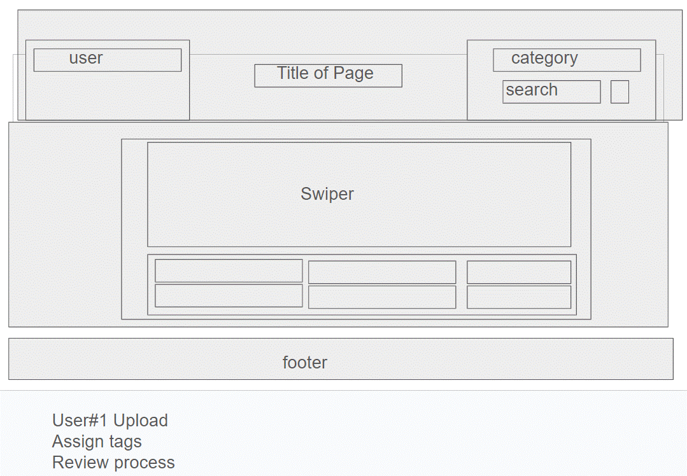

<div align="center">
  
</div>

# Picturific

Picturific is a streamline app for labeling your pictures.

## Description

Provide a short description explaining the what, why, and how of your project. Use the following questions as a guide:

- What was your motivation?
- Why did you build this project? (Note: the answer is not "Because it was a homework assignment.")
- What problem does it solve?
- What did you learn?

## Access to application

URL: 

GitHub Repo: https://github.com/brianleepetros/group-02-picturific

## Usage

Provide instructions and examples for use. Include screenshots as needed.

To add a screenshot, create an `assets/images` folder in your repository and upload your screenshot to it. Then, using the relative filepath, add it to your README using the following syntax:

```md

```

## Contributing


## License

[MIT](https://choosealicense.com/licenses/mit/)