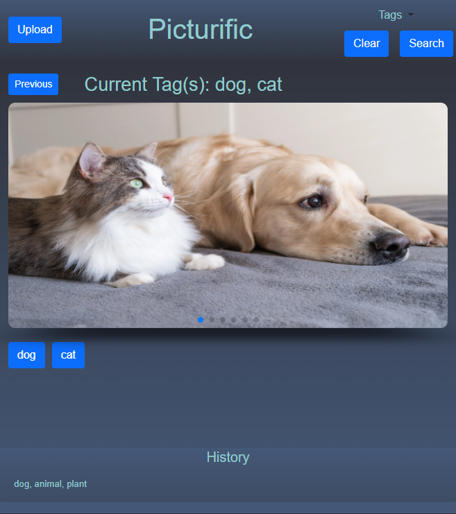

  

# Picturific
### Create & share your own picture carousel

A place to organize, display, and share customizable photo gallery online with others.

Picturific is an innovative web application designed to offer a personalized image viewing experience
- dynamic tagging

- intuitive carousel interface

### Functional Concept
- Photo gallery that allows users to find pictures based on tags

- A place to organize and display photo gallery

- Display and share customizable photo gallery online with others

### Description
Users are able to:
- Input urls and assign associated tags

- Select from a diverse set of tags to filter and display images that match their interests
    - (pets, plants, scenery, and more…)

### App Design/Build
- Leveraging local storage, the app ensures a seamless user experience by remembering user preferences and tags, while offering a visually appealing and responsive design

- Built with modern web technologies
    - Bootstrap
    - Swiper.js

## User Experience
Generate picture carousel by keyword(s):
- Select from a diverse set of tags to filter and display images
    (pets, plants, scenery, and more…)

Upload & tag pictures:
- Upload button activates pop-up module

- Add picture by URL and select keywords to tag image used by search feature

## Access to application
URL: https://brianleepetros.github.io/group-02-picturific/

GitHub Repo: https://github.com/brianleepetros/group-02-picturific

## Future development
- Implement cloud server
- User login
- Custom tag generation
- Rebranding of logo

  

## Credits/Links
### Development Team
Stephen Sneed: https://github.com/sfsneed70

Justin Kao: https://github.com/PandaKao

Brian Petros:  https://github.com/brianleepetros

### Access to application
URL: https://brianleepetros.github.io/group-02-picturific/

GitHub Repo: https://github.com/brianleepetros/group-02-picturific

## License

[MIT](https://choosealicense.com/licenses/mit/)