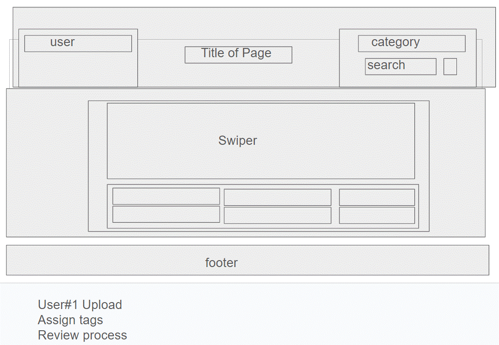

  

# Picturific
Picturific is a streamline app for labeling your pictures.

## Description
Allow the ability to view pictures in a photo carousel and view/assign labels to describe each picture by:
- category
- type 1
- type 2
- type 3
- type 4
- type 5 

Motivation for creating this app was... and created this app for this purpose...

Lessons learned were... implementing Bootstrap and Swiper functionality...

## Access to application
URL: 

GitHub Repo: https://github.com/brianleepetros/group-02-picturific

## Usage
Provide instructions and examples for use. Include screenshots as needed.

To add a screenshot, create an `assets/images` folder in your repository and upload your screenshot to it. Then, using the relative filepath, add it to your README.

## Credits
List your collaborators, if any, with links to their GitHub profiles.

GitHub profiles:
- Brian Petros
    - https://github.com/brianleepetros
- Justin
    - https://github.com/PandaKao
- Stephen
    - https://github.com/aquarius70

If you used any third-party assets that require attribution, list the creators with links to their primary web presence in this section.

If you followed tutorials, include links to those here as well.

## License

[MIT](https://choosealicense.com/licenses/mit/)